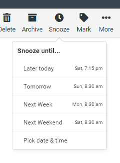

# Snooze (Roundcube)

Adds the ability to "snooze" email messages to [Roundcube](http://roundcube.net/).



## Installation

Prerequistites:

* RoundCube 1.5.2 with Elastic skin
* DoveCot 2.2.33.2 
* Python 3.6.9

Please note:

* Other versions of the above may work, but this is the configuration I tested with.  
* Only DoveCot IMAP back ends are supported although others might work if you're able to create an appropriate wake-up script. 
* Anything other than the above and you're on your own.

**IMPORTANT** This plugin re-writes email messages and can  change DoveCot's internally stored date (ie: the arrival time) for the message.  This might violate regulatory and compliance rules of some companies and organisations.  *It's up to you to check this*.

Installation:

1. In your RoundCube plugin directory. eg:

    ```
    cd /usr/local/lib/roundcubemail/plugins/
    ```

2. Clone the git repository into a subdirectory named "`snooze`":

    ```
    git clone https://github.com/toptensoftware/roundcube-snooze.git snooze
    ```

3. Edit Roundcube's main configuration file eg:

    ````
    vi /usr/local/lib/roundcubemail/config/config.inc.php
    ````

    and add the plugin's name to the active plugins array. eg:

    ```php
    $config['plugins'] = array('snooze');
    ```

4. Configure a crontab job to run the server-side wake up script:

    ```
    crontab -e
    ```

    with something like this (for accurate wake times):

    ```
    * * * * * python3 /usr/local/lib/roundcubemail/plugins/snooze/snooze.py
    ```

    or, perhaps every five minutes will suffice (who snoozes emails to 13 past the hour anyway?)

    ```
    */5 * * * * python3 /usr/local/lib/roundcubemail/plugins/snooze/snooze.py
    ```

    (Obviously, you'll need python3 installed).

5. Optionally, configure dovecot so that each user has a mailbox named `Snoozed`.
    (without this, each user must manually create the mailbox)

## Usage

Snoozing an email:

1. If you don't already have it, create a root level mailbox named `Snoozed`.

2. Select the email(s) to snooze.

3. From the toolbar, click the "Snooze" button and choose what time the message should be woken.

4. When the snooze time arrives, the email will be automatically moved back to its
    original mailbox (or the inbox if that mailbox no longer exists).

Notes:

* When an email is snoozed, it will appear in the Snoozed mailbox and a note will be
  added to the header when viewing the message showing when the message is due to 
  be woken.

* When an email is woken, it will be moved back to its original mailbox and a note
  shown in the message header saying when it was originally snoozed.

* You can manually unsnooze a snoozed message via the unsnooze command (either from
  the message header, or the toolbar drop down).

* You can also unsnooze a message by simply moving it out of the Snoozed mailbox.

* When an email is woken, it's arrival date will be changed to the time it was woken
  and it will be marked as unread.


## Configuration

See the `config.in.php` in the plugin directory for configuration options.

Run `python3 snooze.py --help` for options controlling the wake up script.

## How it Works

The plugin stores all snooze information in a custom e-mail header named `X-Snoozed` in the following format:

```
X-Snoozed: at Fri, 13 May 2022 10:16:56 +1000;
    until Fri, 13 May 2022 10:17:00 +1000;
    from INBOX;
    woken
```

Where: 

* `at` = the time the message was snoozed
* `until` = the time the message is scheduled to be woken
* `from` = the mailbox the message was in before being snoozed
* `woken` = present if the message tripped its scheduled time and was woken by the crontab script.

Since IMAP emails are immutable any changes to this header requires "re-writing" the email. ie: fetching the email, creating a new email with the same content and deleting the original email.

Snoozing an email uses IMAP to:

1. Fetch the entire original email
2. Remove any old X-Snoozed header
3. Add a new X-Snoozed header
4. Save the modified message back to the original mailbox
5. Delete the original message
6. Move the message to the Snoozed mailbox

Snoozing an already snoozed email is similar to the above
except the "from" mailbox attribute is copied from the existing snooze header.

Manually unsnoozing a snoozed email is basically the opposite, again done via IMAP:

1. Fetch the entire original email
2. Remove any old X-Snoozed header
3. Save the modified message
4. Move the message out of the Snoozed mailbox back to its original location.

The wake script needs to work without knowing the user's login details and uses the `doveadm` tool to:

1. Enmuerate the Snoozed mailboxes for all users (`doveadm mailbox`)
2. Enumerate all messages in the Snoozed mailbox with the X-Snoozed header. (`doveadm fetch`)
3. Check the header's 'until' attribute and compare to the current date/time


For emails that are due to be woken:  

1. Fetch the email (`doveadm fetch`)
2. Modify the X-Snoozed header adding the `woken` tag.
3. Save the message back to its original mailbox (`doveadm save`)
4. Deleting the original message (`doveadm expunge`)


## Known Issues and Limitations

* Requires Elastic skin, but will accept a pull requests for other skins.
* Currently only available in English, but will accept a pull requests for translations.

## License

This program is free software: you can redistribute it and/or modify it under the terms of the GNU General Public License as published by the Free Software Foundation, either version 3 of the License, or (at your option) any later version.

This program is distributed in the hope that it will be useful, but WITHOUT ANY WARRANTY; without even the implied warranty of MERCHANTABILITY or FITNESS FOR A PARTICULAR PURPOSE. See the GNU General Public License for more details.

You should have received a copy of the GNU General Public License along with this program. If not, see <https://www.gnu.org/licenses/>.